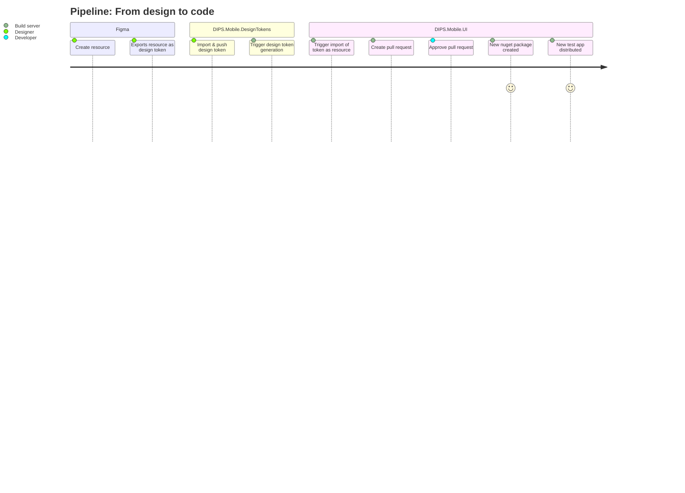

 

To support developers building DIPS mobile native apps, the designers maintain a Design System with
style [resources](https://github.com/DIPSAS/DIPS.Mobile.UI/tree/main/src/library/DIPS.Mobile.UI/Resources)
and [components](https://github.com/DIPSAS/DIPS.Mobile.UI/tree/main/src/library/DIPS.Mobile.UI/Components). These
resources and components are available for the developers by using DIPS.Mobile.UI as a dependency for their app.

This project is well documented with examples on how to use the components from DIPS. The documentation can be found in
the [wiki](https://github.com/DIPSAS/DIPS.Mobile.UI/wiki) section.

# Using the library

Please make sure to read the [Getting started](https://github.com/DIPSAS/DIPS.Mobile.UI/wiki/Getting-Started) before
using the library for your app.

## Build status

 

# Live test with app

To test the resources and components live you are welcome to download the DIPS Mobile UI Components app. Use the below
links or barcodes for your platform:

| iOS                                                                                                         | Android                                                                                                       |
|-------------------------------------------------------------------------------------------------------------|---------------------------------------------------------------------------------------------------------------|
|         |       |
| [Download link](https://install.appcenter.ms/orgs/dips-as/apps/components-ios/distribution_groups/releases) | [Download link](https://install.appcenter.ms/orgs/dips-as/apps/components-droid/distribution_groups/releases) |

> When you have downloaded the app it will prompt you to download new versions onces they are out.

# From design to code

## Design Tokens

The style resources (colors, sizes, icons etc) in this library is generated
in [DIPS.Mobile.DesignTokens](https://github.com/DIPSAS/DIPS.Mobile.DesignTokens), which is exported from the Design
System. The point of having design tokens is for developers and designers to use the same terms when discussing design
or implementing a design in an application. The design tokens is exported in various formats, but they must be machine
readable. Not everything can be exported as design tokens, but DIPS.Mobile.UI is using exported colors, sizes and icons.
These are refered to as resources, and the resources are available for developers in .NET Standard, Android and iOS
project by xaml/xml resources or APIs.

## Workflow

The designers is maintaining prototypes and design in Figma. They also maintain their resources and components, which
makes it easy to reuse throughout design and prototypes. The resoruces can be exported to various formats.

The following pipeline is used when a new resource is added to DIPS.Mobile.UI:

1. The designer wants to create a new color, size or icon to be reused. They come up with a name for the resource and
   the resource gets created.
2. The designer export the resource from Figma to a format that the developers and designers agree on.
3. The designer imports (push, uploads) the exported resource to DIPS.Mobile.DesignTokens repository.
4. A build server trigger from the designer pushing the new design token
   to [DIPS.Mobile.DesignTokens](https://github.com/DIPSAS/DIPS.Mobile.DesignTokens). The build server generates the
   design token to a format that can be used in [DIPS.Mobile.UI](https://github.com/DIPSAS/DIPS.Mobile.UI).
6. A build server triggers once the design token has been generated. This build server grabs the resource and places it
   in a local DIPS.Mobile.UI repository.
7. A new Pull Request gets created to the remote DIPS.Mobile.UI repository.
8. The Pull Request has to be approved by the maintainers of DIPS.Mobile.UI.
9. Once the Pull Request is approved, it gets merged to DIPS.Mobile.UI. A new nuget version of the library is published
   and the nuget package can be used in a mobile app. A new version of the test app is distributed, and the designers
   can test their resource right away.

 

